# 米斯特安全团队的远海往事:

## 爆料的面试：

00后的小毛孩？铁FVV好吧

之前面试过他，整个面试过程问题如下：

### ***/*问：说一次最好的渗透测试经历吧！/****

***/*远海大神回答：/****

### ***/*问：学校网站存在什么漏洞？你怎么拿下跳板机的？/****

***/*远海大神回答：/****

答非所问好吧，信息收集？弱口令？SQL注入？你在说啥？是太紧张了吗？

### ***/*问：你太紧张了吧，好好说，怎么注入进去的，什么环境？/****

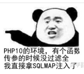

### 问：你还是没有回答清楚我的问题，你说你代码审计审计到的漏洞，那你还记得是具体是代码中的那个地方出问题了吗？WAF是过滤了什么？PHP10是什么鬼？

***/*扫盲：/****PHP 团队于2020年11月26日宣布 PHP 8 正式发布，面试时间为2020年12月某天

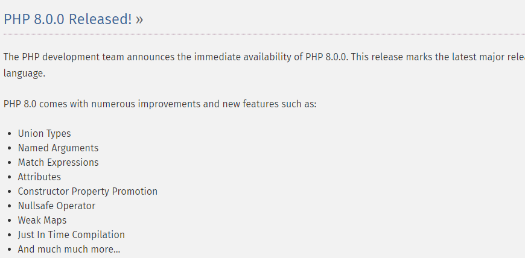

至于远大神所说的PHP10我是真没听过，领先时代？未来？穿越了？一直强调SQLMAP干嘛，一把梭？真大神？

***/*远大神回应：/****

### ***/*问：我看你简历上写着再EDUSRC挖了很多洞，有和那后的例子吗？/****

***/*远大神回应：/****

### ***/*问：那基本上是你朋友帮你吗？还是大部分是你自己挖的？/****

***/*远大神回应：/****

### ***/*问：那我换个问题问你，你给我说说怎么做的信息收集吧！/****

***/*远大神回应：/****

### ***/*问：什么？CMD5？查什么？/****

***/*远大神回应：/****

### ***/*我：？？？？？？？啥？啥啥？怎么又扯到SQLMAP上面了，你是只会用这一个工具吗？/****

***/*远大神回应：/****

### ***/*问：我看到你会写工具？你用什么语言写工具？/****

***/*远大神回应：/****

### ***/*问：那你再说说，C++有哪些性质吧！/****

***/*远大神回应：/****

***/*（面试基本上可以说结束了，简历上写的一问三不知）/****

***/*事后：/****

***/*结果：/****

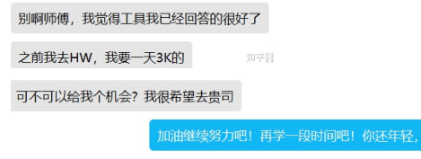

***/*听说前段时间被请到SXF的晚会上面了，咱也不知道他是咋上去的，咱也不敢问，咱也不敢说谁叫人家是远海大神呢。还是排行第一，真担心被/*.../****

***/*再看到几个大神之前对他加入的团队评价：/****

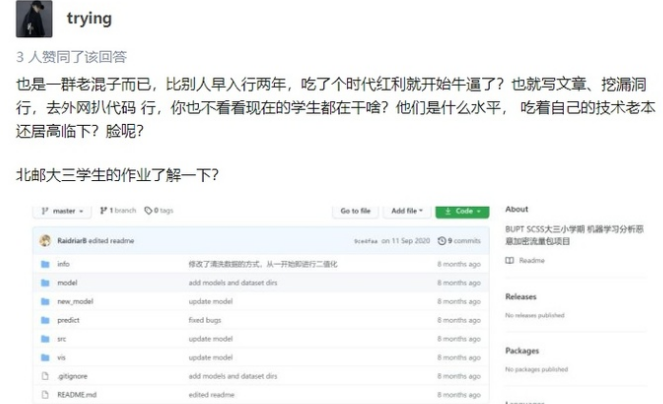

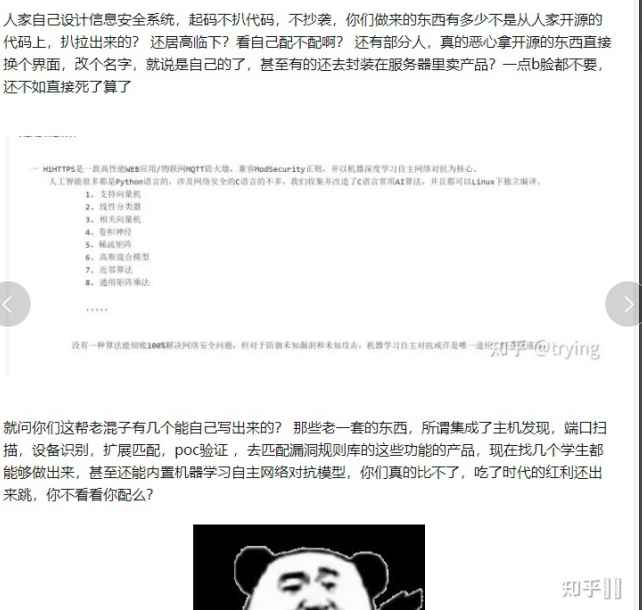

***/*果然，Ctrl+c Ctrl+V 大师啊！/****

***/*一个字：绝！/****

***/*一个字：妙！/****

***/*我也想问问这些人：/****

***/*适合站在所谓的安全圈顶端吗？守护谁的安全？知道你普普通通了，就不要来割韭菜了好吗？/****

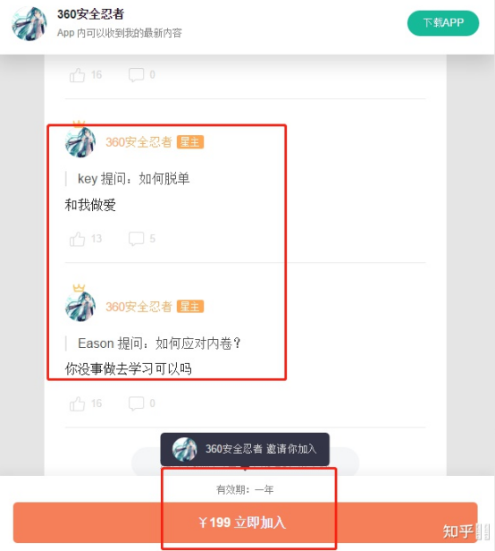

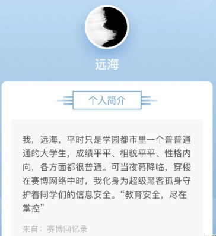

## 大佬爆料的多个ID做灰产：

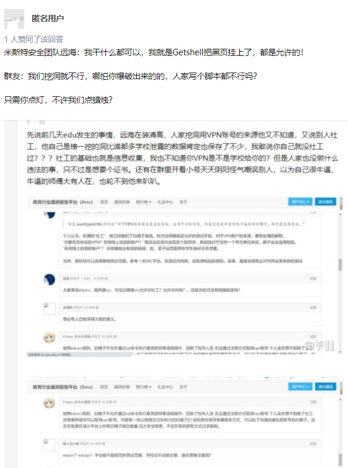

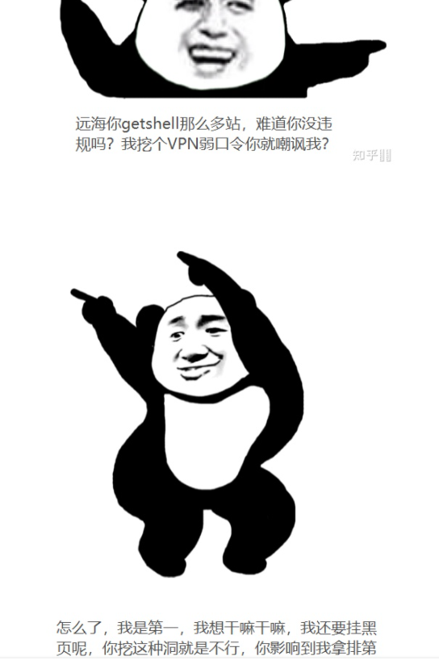

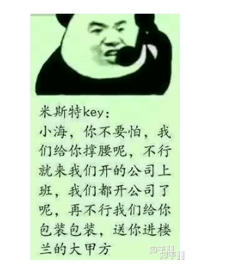

### 大佬自作自受：

## 大佬提问：

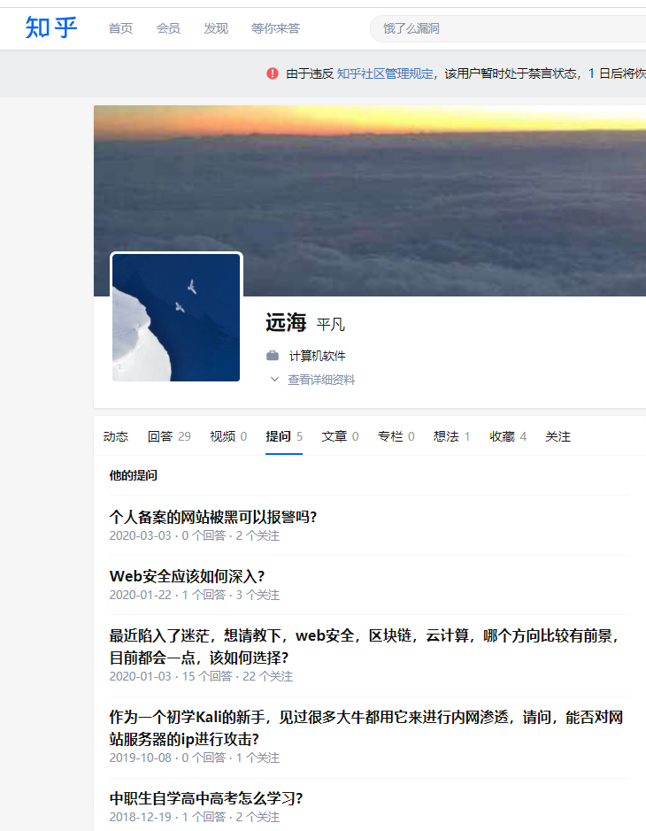

# 更多爆料尽情期待！强烈建议此人滚出网络安全圈！

# 回去继续刷你的QQ钻！